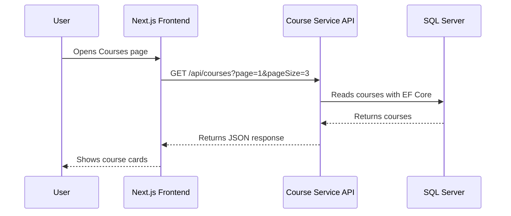
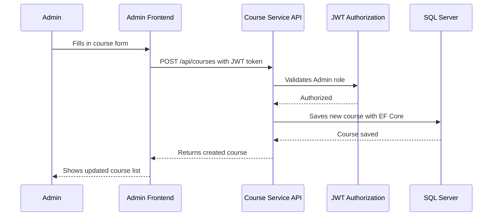
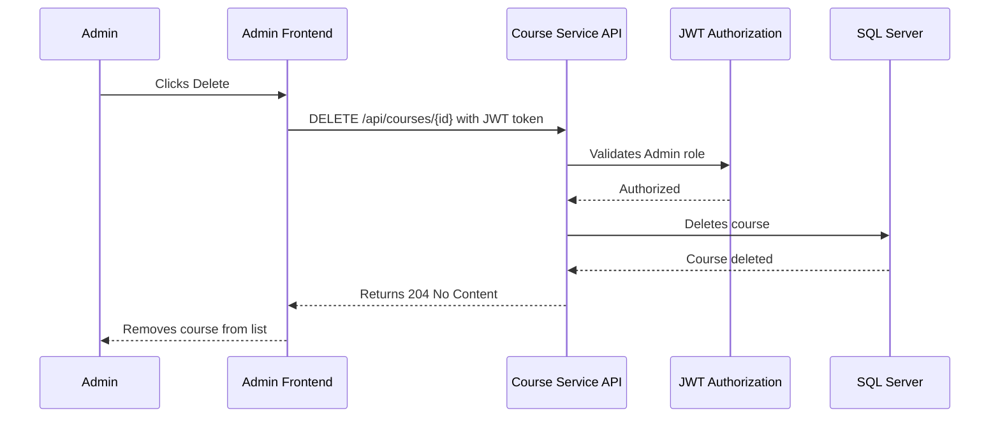

# Course Service API

Course Service is a part of the Shiko LMS platform built with ASP.NET Core Web API and Next.js.

The service handles course management functionality including getting all courses, getting courses by id, creating courses, updating courses and deleting courses.

The project uses Entity Framework Core with SQL Server and follows a microservice-based architecture.

# Technologies

Backend:
- ASP.NET Core Web API
- Entity Framework Core
- SQL Server
- Swagger / OpenAPI
- Scalar
- JWT Authentication

Frontend:
- Next.js
- TypeScript
- CSS Modules

Other:
- GitHub
- Azure App Service
- Azure SQL Database

# Features

Course API:
- GET all courses
- GET course by id
- POST create course
- PUT update course
- DELETE course

Admin Panel:
- Create courses
- Edit courses
- Delete courses

Documentation:
- Swagger documentation
- Scalar API documentation

# Project Structure

Backend:
CourseService.Api

Folders:
- Controllers
- Data
- Dtos
- Models
- Services
- Migrations

Frontend:
- src/app/courses
- src/app/courses/admin

# Frontend Routes

Courses:
http://localhost:3000/courses

Admin Courses:
http://localhost:3000/courses/admin

# API Endpoints

Get all courses:
GET /api/courses

Get course by id:
GET /api/courses/{id}

Create course:
POST /api/courses

Update course:
PUT /api/courses/{id}

Delete course:
DELETE /api/courses/{id}

# Swagger

Swagger documentation:
https://localhost:7102/swagger

# Local Setup

Backend:

Install packages:

dotnet restore

Run migrations:

dotnet ef database update

Run API:

dotnet run

Frontend:

Install packages:

npm install

Run frontend:

npm run dev

# Database

The project uses SQL Server with Entity Framework Core migrations.

Seed data is automatically added when the application starts.

# Security

The API supports:
- JWT Authentication
- Authorization
- Protected admin functionality

# Testing

The project includes testing for:
- API functionality
- CRUD operations
- Course service logic

# Deployment

Frontend:
Deployed with Vercel.

Backend:
Deployed with Azure App Service.

Database:
Azure SQL Database.

# Authors

CMS25 .NET2 – Nackademin  
Shiko LMS Project

## System Architecture Diagram

## Sequence Diagrams

### Get Courses Flow

### Admin Create Course Flow

### Delete Course Flow

